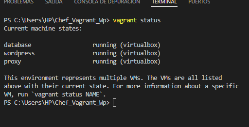
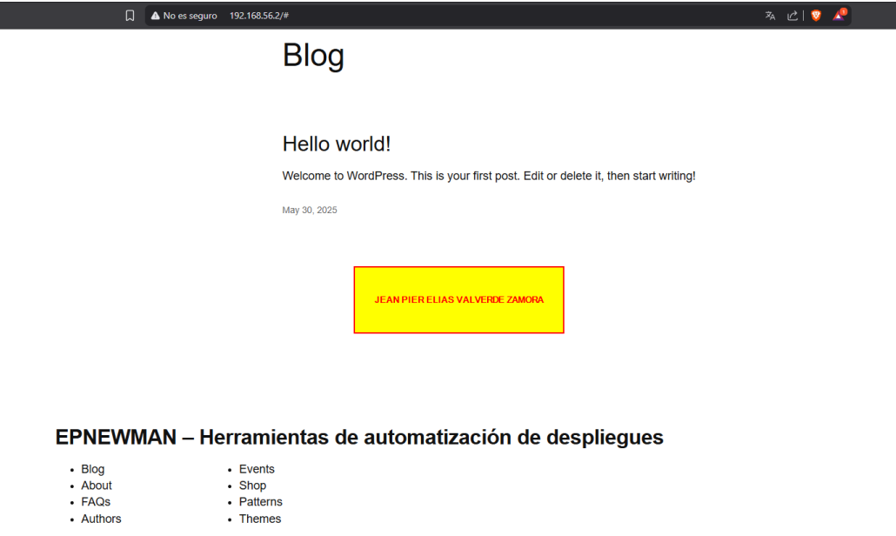
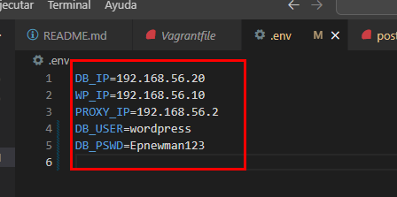
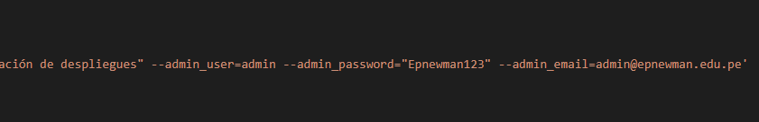
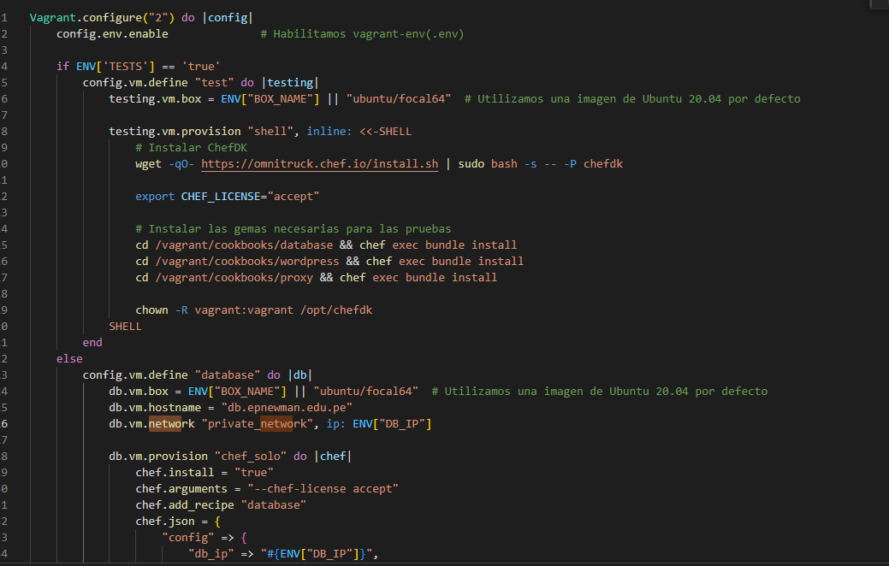
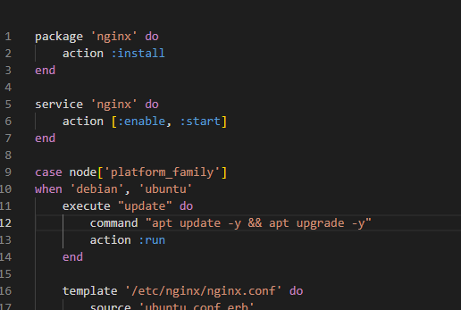
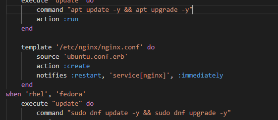
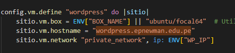
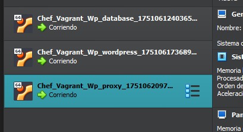

# AS_U3_EXAMEN_PRACTICO

# INFORME FINAL DE AUDITORÍA DE SISTEMAS

## CARÁTULA

**Entidad Auditada:** Chef_Vagrant_Wp Deployment  
**Ubicación:** [Tacna, Perù]  
**Período auditado:** [20/06/2025 hasta 27/06/2025]  
**Equipo Auditor:** [Jean Pier Elias Valverde Zamora]  
**Fecha del informe:** [27/06/2025]  

**LINK REPO**

https://github.com/JeanValverde24/AS_U3_EXAMEN_PRACTICO

## ÍNDICE

1. [Resumen Ejecutivo](#1-resumen-ejecutivo)  
2. [Antecedentes](#2-antecedentes)  
3. [Objetivos de la Auditoría](#3-objetivos-de-la-auditoría)  
4. [Alcance de la Auditoría](#4-alcance-de-la-auditoría)  
5. [Normativa y Criterios de Evaluación](#5-normativa-y-criterios-de-evaluación)  
6. [Metodología y Enfoque](#6-metodología-y-enfoque)  
7. [Hallazgos y Observaciones](#7-hallazgos-y-observaciones)  
8. [Análisis de Riesgos](#8-análisis-de-riesgos)  
9. [Recomendaciones](#9-recomendaciones)  
10. [Conclusiones](#10-conclusiones)  
11. [Plan de Acción y Seguimiento](#11-plan-de-acción-y-seguimiento)  
12. [Anexos](#12-anexos)  

## 1. RESUMEN EJECUTIVO

La auditoría realizada sobre el entorno Chef_Vagrant_Wp implementado por DevIA360 evidenció riesgos relevantes en la gestión de credenciales, configuraciones de red, registros de auditoría, actualización de software y segregación de ambientes. Se identificó exposición de datos sensibles en archivos de configuración, uso de versiones desactualizadas de aplicaciones y carencia de prácticas adecuadas de seguridad en la infraestructura.

Se recomienda aplicar medidas de mitigación urgentes para garantizar la seguridad, confidencialidad y cumplimiento normativo del entorno de despliegue continuo.

---

## 2. ANTECEDENTES

DevIA360 es una empresa dedicada al desarrollo e integración de soluciones tecnológicas, especializada en infraestructura automatizada para aplicaciones web. Como parte de sus servicios, DevIA360 emplea la solución Chef_Vagrant_Wp que automatiza el despliegue de entornos WordPress mediante herramientas como Vagrant y Chef.

El entorno de despliegue continuo es esencial para garantizar entregas ágiles, consistentes y seguras. No obstante, la complejidad de los procesos y la velocidad de implementación generan posibles vectores de riesgo que requieren ser auditados.

---

## 3. OBJETIVOS DE LA AUDITORÍA

**Objetivo General:**

- Evaluar la seguridad, eficiencia y cumplimiento normativo del proceso de despliegue continuo de infraestructura WordPress mediante la solución Chef_Vagrant_Wp utilizada por DevIA360, identificando vulnerabilidades técnicas y configuracionales que puedan comprometer la confidencialidad, integridad o disponibilidad de los servicios desplegados.

**Objetivos Específicos:**

- Revisar la configuración de redes privadas en el entorno Vagrant, identificando posibles deficiencias que impidan la conectividad entre máquinas virtuales o expongan servicios innecesariamente.

- Detectar la presencia de credenciales sensibles almacenadas en texto plano dentro de las recetas Chef o archivos de configuración, evaluando el riesgo de fuga de información confidencial.

- Verificar la existencia y correcto funcionamiento de mecanismos de logging y trazabilidad en las máquinas virtuales para facilitar auditorías y análisis forenses.

- Analizar la correcta segregación de ambientes (desarrollo, pruebas y producción) en las configuraciones de Vagrant y recetas Chef, a fin de evitar mezclas de datos sensibles entre entornos.

- Identificar la utilización de componentes de software o dependencias desactualizadas que puedan introducir vulnerabilidades conocidas en el entorno WordPress y en la infraestructura de soporte.

---

## 4. ALCANCE DE LA AUDITORÍA

- Entorno auditado: Chef-Vagrant-WordPress, incluyendo la infraestructura desplegada mediante Vagrant sobre VirtualBox y la automatización de la instalación de WordPress con Chef y WP-CLI.
- Revisión de:
  - Vagrantfile, para identificar configuraciones inseguras, exposición innecesaria de puertos y posibles errores en la definición de redes privadas.

  - Recetas Chef, incluyendo archivos attributes/default.rb y metadata.rb, para detectar almacenamiento de credenciales en texto plano, versiones desactualizadas de software y ausencia de segregación de ambientes (desarrollo, pruebas, producción).

  - Configuración de red privada, verificando la conectividad entre las máquinas virtuales definidas como database, wordpress y proxy, y evaluando riesgos de accesos no autorizados.

  - Accesos al entorno WordPress, validando el correcto funcionamiento de la instalación automatizada mediante WP-CLI y el acceso a la interfaz web, para confirmar la disponibilidad y seguridad del servicio.

  - Logs y monitoreo, revisando los archivos de registro generados en las máquinas virtuales para asegurar la trazabilidad de operaciones, identificación de errores y soporte a eventuales investigaciones de incidentes.

- Periodo auditado: [Desde 20/06/2025 hasta 27/06/2025]

---

## 5. NORMATIVA Y CRITERIOS DE EVALUACIÓN

- ISO/IEC 27001:2022
  Norma internacional que establece requisitos para un Sistema de Gestión de Seguridad de la Información (SGSI). Se utilizó como marco de referencia para evaluar la confidencialidad, integridad, disponibilidad y trazabilidad en el entorno Chef-Vagrant-WordPress, particularmente en aspectos relacionados con la protección de credenciales, segregación de ambientes y registros de auditoría.

 - OWASP ASVS 4.0.3 (Application Security Verification Standard)
   Estándar de seguridad de aplicaciones utilizado para analizar configuraciones, exposición de puertos, uso de versiones actualizadas de componentes y manejo seguro de credenciales en el proceso de despliegue automatizado.

 - Buenas prácticas DevOps
   Conjunto de prácticas orientadas a la integración segura y eficiente de desarrollo y operaciones. Fueron aplicadas como criterio para evaluar:

    - Gestión de infraestructura como código.

    - Separación de entornos (desarrollo, pruebas, producción).

    - Automatización de despliegues de manera segura.

    - Mantenimiento de logs y trazabilidad de cambios.

    - Políticas internas de seguridad (simuladas)
        Políticas definidas de forma simulada para este ejercicio práctico, utilizadas como criterio de evaluación para validar el cumplimiento de:

        - Protección de información sensible.

        - Restricciones de acceso a redes y servicios.

        - Uso de buenas prácticas en configuración de servidores y servicios web.

---

## 6. METODOLOGÍA Y ENFOQUE

La auditoría se realizó mediante un enfoque técnico y basado en riesgos, combinando análisis manual y ejecución de pruebas técnicas, orientadas a identificar vulnerabilidades en el entorno automatizado Chef-Vagrant-WordPress.

Las actividades específicas desarrolladas fueron:
- Revisión de archivos de configuración (Vagrantfile, recetas Chef).
    Para identificar configuraciones inseguras, exposición de servicios, errores en redes privadas, credenciales en texto plano y uso de versiones obsoletas de componentes.
- Inspección de variables de entorno y credenciales.
  Para validar la existencia y correcta definición de las variables necesarias para el despliegue, y detectar posibles riesgos de seguridad asociados a información sensible almacenada sin protección.
- Ejecución de comandos:
  - `vagrant up` -> Para inicializar y provisionar las máquinas virtuales.
  - `vagrant status` -> Para verificar el estado de las máquinas virtuales y confirmar que los servicios se encuentran corriendo.
- Acceso a la interfaz WordPress.
    Para comprobar el despliegue exitoso del entorno, así como validar su accesibilidad y comportamiento desde el navegador web.
- Captura de evidencias (screenshots).
    Para sustentar los hallazgos técnicos y documentar pruebas realizadas, conforme a los anexos del informe de auditoría.
- Análisis de logs.
    Para identificar errores de provisión, detectar problemas de codificación, revisar fallos en el proceso de despliegue y verificar la existencia de trazabilidad ante posibles incidentes de seguridad.

---

## 7. HALLAZGOS Y OBSERVACIONES

### Hallazgo N°1 — Falta de definición explícita de puertos expuestos

- **Descripción:** El archivo Vagrantfile expone el puerto 80 del guest al 8080 del host.
- **Evidencia:** [Ver Anexo C - Puertos Vagrantfile]
- **Grado de criticidad:** Medio
- **Criterio vulnerado:** Principio de mínimo privilegio.
- **Causa:** Configuración por defecto.
- **Efecto:** Posible acceso no autorizado desde host o red interna.

---

### Hallazgo N°2 — Dependencia crítica de variables de entorno

- **Descripción:** Vagrantfile depende de múltiples variables de entorno (ENV[...]) para definir direcciones IP, usuarios y contraseñas. Si dichas variables no existen o están mal definidas (como se evidenció durante las pruebas), el entorno se levanta incompleto o sin red privada, causando fallos críticos en la conectividad entre máquinas.
- **Evidencia:** [Ver Anexo D - Fragmento de Vagrantfile]
- **Grado de criticidad:** Medio
- **Criterio vulnerado:** COWASP ASVS 4.0.3 — Secure Deployment Configuration.
- **Causa:** Omisión en la definición de puertos para acceso controlado.
- **Efecto:** Posibles configuraciones manuales inseguras por parte de operadores, exponiendo servicios innecesariamente.

### Hallazgo N°3 — Credenciales en texto plano en recetas Chef

- **Descripción:** Las credenciales de conexión a la base de datos (usuario y contraseña) se almacenan en texto plano en los atributos y comandos de las recetas Chef, lo cual representa un riesgo significativo en entornos productivos. No se están utilizando mecanismos de cifrado como encrypted data bags o vaults.
- **Evidencia:** [Ver Anexo E - Fragmento de post_install.rb]
- **Grado de criticidad:** Alta
- **Criterio vulnerado:**  ISO/IEC 27001:2022 — Cláusula 8.2 (Protección de información en medios).
- **Causa:** Falta de validación o asignación de valores por defecto para las variables de entorno.
- **Efecto:** Aislamiento entre las máquinas virtuales, impidiendo la instalación correcta de WordPress.

### Hallazgo N°4 —  Ausencia de segregación de ambientes

- **Descripción:** El despliegue está diseñado con un único conjunto de configuraciones para todas las máquinas, sin distinción entre entornos de desarrollo, pruebas o producción. Las mismas credenciales y configuraciones se replican sin separación lógica.
- **Evidencia:** [Ver Anexo F - Fragmento de Vagrantfile]
- **Grado de criticidad:** Alta
- **Criterio vulnerado:**  Buenas prácticas DevOps — Environment Segregation.
- **Causa:** Simplicidad en el diseño del despliegue.
- **Efecto:**  Riesgo de que datos de producción sean expuestos en ambientes de prueba, o de que configuraciones inseguras se migren a producción.

### Hallazgo N°5 —  Versiones de software no especificadas

- **Descripción:** Las recetas Chef no declaran versiones específicas de software a instalar (por ejemplo, nginx, php, mysql), lo cual implica que se instalan siempre las últimas versiones disponibles en el repositorio de la distribución. Esto es adecuado para pruebas, pero en producción puede generar incompatibilidades o introducir vulnerabilidades sin control.
- **Evidencia:** [Ver Anexo G -  Fragmento de default.rb]
- **Grado de criticidad:** Medio
- **Criterio vulnerado:**  OWASP Top 10 — A06:2021 (Vulnerable and Outdated Components).
- **Causa:** Simplificación del cookbook para entornos de pruebas.
- **Efecto:** Potenciales vulnerabilidades introducidas por actualizaciones no testeadas.

### Hallazgo N°6 —  Configuración de Nginx sin hardening

- **Descripción:** El archivo default.rb define la instalación de Nginx, pero no incluye directivas específicas para la seguridad de headers HTTP (p. ej. X-Frame-Options, Content-Security-Policy, X-Content-Type-Options). Además, se utiliza la configuración por defecto de Nginx, lo cual no es recomendable para entornos productivos.
- **Evidencia:** [Ver Anexo H -  Fragmento de default.rb]
- **Grado de criticidad:** Medio
- **Criterio vulnerado:**  OWASP ASVS 4.0.3 — Secure HTTP Configuration.
- **Causa:** Simplicidad de configuración para entorno de pruebas.
- **Efecto:** Incremento de la superficie de ataque por headers no configurados.

### Hallazgo N°7 —  Duplicación de hostname en Vagrantfile

- **Descripción:** En el archivo Vagrantfile, tanto la máquina virtual wordpress como la máquina virtual proxy están configuradas con el mismo hostname wordpress.epnewman.edu.pe. Esto puede provocar conflictos en la resolución de nombres dentro de la red privada y errores en la configuración de servicios que dependan del hostname.
- **Evidencia:** [Ver Anexo I - Fragmento de Vagrantfile]
- **Grado de criticidad:** Alta
- **Criterio vulnerado:**  Buenas prácticas DevOps — Hostname Uniqueness.
- **Causa:** Error de configuración al copiar bloques de definición de máquinas en el Vagrantfile.
- **Efecto:** Posibles fallos de conectividad, errores de servicio o confusión en registros de logs.

### Hallazgo N°8 —  Falta de validación de integridad en descargas remotas

- **Descripción:** En el archivo post_install.rb, la descarga del binario WP-CLI se realiza desde un repositorio remoto sin ninguna validación de integridad, como verificación de hash SHA256. Esto representa un riesgo, ya que un archivo malicioso podría sustituir el original en el repositorio remoto.
- **Evidencia:** [Ver Anexo J - Fragmento de post_install.rb]
- **Grado de criticidad:** Alta
- **Criterio vulnerado:**  OWASP ASVS 4.0.3 — Secure Software Download.
- **Causa:** Omisión de verificación de seguridad por simplicidad en el script.
- **Efecto:** Riesgo de ejecución de código malicioso en el servidor WordPress.
---

## 8. ANÁLISIS DE RIESGOS

| Hallazgo | Riesgo asociado                                   | Impacto | Probabilidad | Nivel de Riesgo |
|----------|---------------------------------------------------|---------|--------------|-----------------|
| 1        | Exposición de servicios innecesarios              | Medio   | Media        | Medio           |
| 2        | Fallo del despliegue por variables indefinidas    | Medio   | Alta         | Alto            |
| 3        | Robo de credenciales                              | Alto    | Alta         | Alto            |
| 4        | Mezcla de datos de producción y pruebas           | Alto    | Alta         | Alto            |
| 5        | Vulnerabilidades por versiones desconocidas       | Medio   | Media        | Medio           |
| 6        | Incremento de superficie de ataque en Nginx       | Medio   | Media        | Medio           |
| 7        | Conflictos de red por hostname duplicado          | Medio   | Media        | Medio           |
| 8        | Ejecución de software malicioso no verificado     | Alto    | Alta         | Crítico         |

### 8.1 MATRIZ DE REISGO

| Riesgo                                 | Causa (Vínculo a Anexo)                    | Impacto | Probabilidad (%) | Nivel de Riesgo |
|----------------------------------------|--------------------------------------------|---------|------------------|-----------------|
| Exposición de servicios innecesarios   | Vagrantfile (Anexo C)                      | Medio   | 70%              | Alto            |
| Fallo del despliegue por variables no definidas | Vagrantfile (Anexo D)                | Medio   | 80%              | Alto            |
| Credenciales sin cifrado               | post_install.rb / Vagrantfile (Anexo E)    | Alto    | 90%              | Crítico         |
| Mezcla de datos de producción y pruebas| Vagrantfile (Anexo F)                      | Alto    | 85%              | Crítico         |
| Vulnerabilidades por versiones no fijas| default.rb (Anexo G)                       | Medio   | 60%              | Medio           |
| Superficie de ataque ampliada en Nginx | default.rb (Anexo H)                       | Medio   | 65%              | Medio           |
| Conflictos de red por hostnames idénticos | Vagrantfile (Anexo I)                   | Medio   | 60%              | Medio           |
| Ejecución de binarios maliciosos       | post_install.rb (Anexo J)                  | Alto    | 85%              | Crítico         |

---

## 9. RECOMENDACIONES

| Hallazgo | Recomendación |
|----------|---------------|
| 1 | Definir explícitamente los puertos expuestos en el Vagrantfile mediante `forwarded_port` y restringir accesos a direcciones IP específicas para minimizar la exposición de servicios. |
| 2 | Asignar valores por defecto a las variables de entorno en el Vagrantfile o implementar scripts de validación que detengan el despliegue si las variables no están definidas. |
| 3 | Sustituir credenciales en texto plano en recetas Chef por mecanismos de cifrado como encrypted data bags, Vault o variables seguras en pipelines CI/CD. |
| 4 | Segregar ambientes (dev, test, prod) en el Vagrantfile y recetas Chef usando variables y configuraciones diferenciadas para evitar mezcla de datos sensibles. |
| 5 | Declarar versiones específicas de paquetes (nginx, PHP, MySQL, etc.) en las recetas Chef para mantener consistencia y evitar vulnerabilidades introducidas por actualizaciones imprevistas. |
| 6 | Incorporar directivas de seguridad en las configuraciones de Nginx, incluyendo cabeceras HTTP seguras como CSP, X-Frame-Options, y X-Content-Type-Options. |
| 7 | Asignar hostnames únicos a cada máquina virtual en el Vagrantfile para evitar conflictos de red y errores en servicios dependientes del nombre del host. |
| 8 | Implementar verificación de integridad (checksum SHA256 o firma digital) en las descargas de binarios como WP-CLI, asegurando que el archivo descargado sea legítimo y no malicioso. |

---

## 10. CONCLUSIONES

El entorno Chef-Vagrant-WordPress auditado presenta debilidades críticas de seguridad y configuración que podrían comprometer la integridad y disponibilidad del servicio, especialmente en escenarios productivos. Aunque emplea herramientas modernas de automatización, requiere mejoras significativas en gestión de credenciales, segregación de ambientes y validación de integridad de componentes para considerarse un entorno seguro y robusto.

---

## 11. PLAN DE ACCIÓN Y SEGUIMIENTO

| Hallazgo | Recomendación | Responsable | Fecha Comprometida |
|----------|---------------|-------------|--------------------|
| 1 | Definir y restringir puertos en Vagrantfile mediante `forwarded_port` y firewalls. | DevOps | [dd/mm/aaaa] |
| 2 | Asignar valores por defecto a variables de entorno o implementar validaciones previas al despliegue. | DevOps | [dd/mm/aaaa] |
| 3 | Reemplazar credenciales en texto plano por encrypted data bags, Vault o variables seguras en CI/CD. | DevOps | [dd/mm/aaaa] |
| 4 | Implementar segregación de ambientes en Vagrantfile y recetas Chef con configuraciones diferenciadas. | DevOps | [dd/mm/aaaa] |
| 5 | Declarar versiones específicas de paquetes en las recetas Chef para mantener consistencia y seguridad. | DevOps | [dd/mm/aaaa] |
| 6 | Incorporar cabeceras HTTP de seguridad en las configuraciones de Nginx. | DevOps | [dd/mm/aaaa] |
| 7 | Asignar nombres de host únicos a cada máquina virtual en el Vagrantfile. | DevOps | [dd/mm/aaaa] |
| 8 | Implementar verificación de integridad (checksum SHA256 o firma digital) en descargas de binarios como WP-CLI. | DevOps | [dd/mm/aaaa] |

---

## 12. ANEXOS

- [Anexo A] Vagrant Status

- [Anexo B] Pantalla de WordPress en localhost:8080

- [Anexo C] Configuración de red

- [Anexo D] Variables de entorno

    

- [Anexo E] Credenciales en texto plano

- [Anexo F] Falta de segregación de ambientes

- [Anexo G] Versiones de software no especificadas

- [Anexo H] Configuración de Nginx sin hardening

- [Anexo I] Hostnames duplicados

- [Anexo I] Servicios Corriendo

